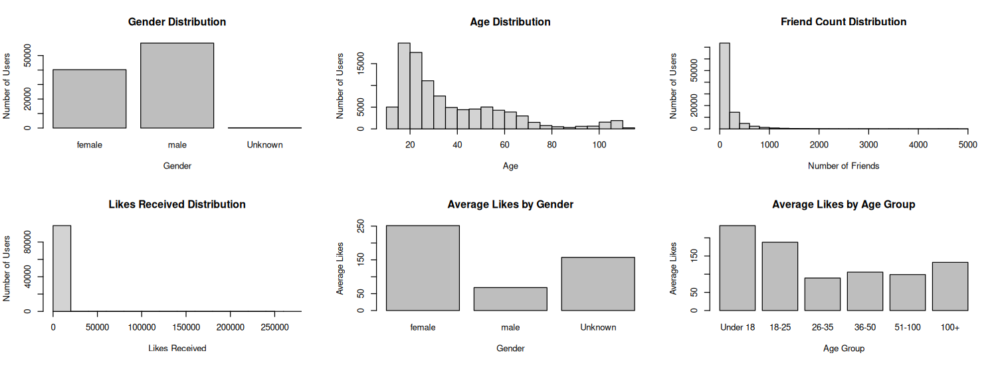
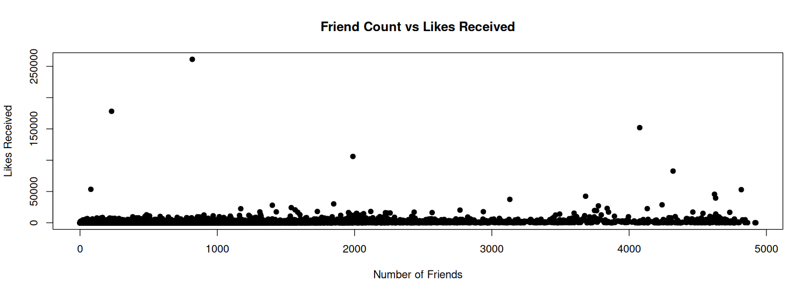
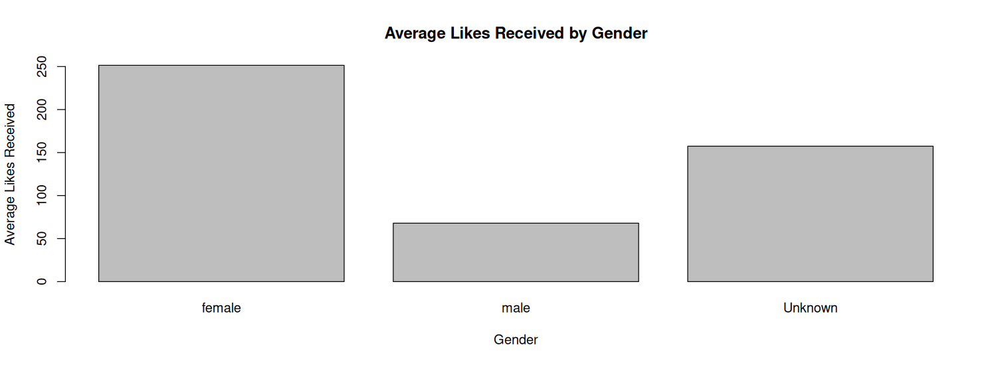
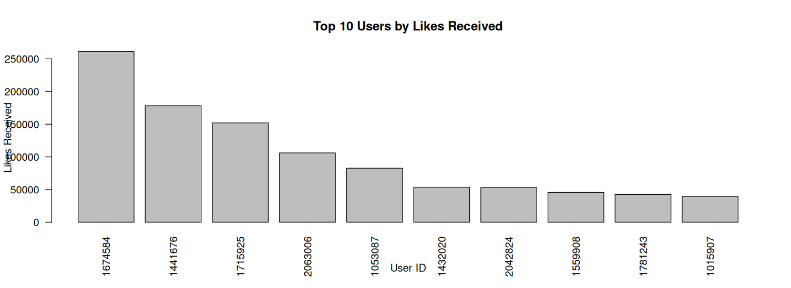
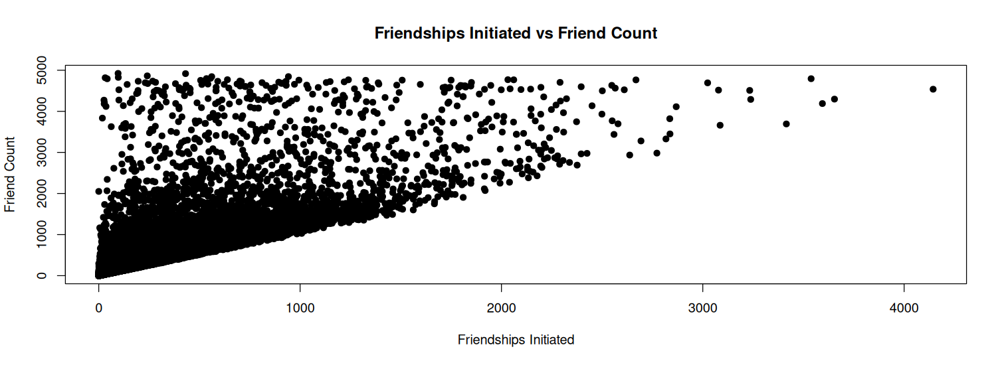

# Facebook Data Analysis Using R

## Project Description
This project focuses on analyzing Facebook user data using the R programming language. The analysis includes data cleaning, preprocessing, exploratory data analysis, statistical analysis, and data visualization to identify patterns in user demographics, friendships, likes, engagement, and platform usage.

## Objectives
The main objectives of this project are:

- To understand and analyze Facebook user data.
- To perform data cleaning and preprocessing.
- To explore user demographics such as age and gender.
- To analyze friendship and engagement patterns.
- To study likes given and likes received by users.
- To compare user activity across different age groups and genders.
- To analyze mobile and web-based activity.
- To identify relationships between important variables using correlation analysis.
- To visualize the findings using R.

- ## Dataset

The dataset used in this project is the **Facebook Data** dataset containing user-level information related to demographics, friendships, likes, and platform activity.

### Dataset Size

- **Total Records:** 99,003
- **Total Variables:** 15
- **File Format:** CSV

The dataset contains information such as age, gender, friend count, friendships initiated, likes, likes received, mobile activity, and web activity.

## Dataset Variables

| Variable | Description |
|---|---|
| `userid` | Unique identifier for each user |
| `age` | Age of the user |
| `dob_day` | Day of birth |
| `dob_year` | Year of birth |
| `dob_month` | Month of birth |
| `gender` | Gender of the user |
| `tenure` | Duration of user activity |
| `friend_count` | Number of friends |
| `friendships_initiated` | Number of friendships initiated |
| `likes` | Number of likes given by the user |
| `likes_received` | Number of likes received by the user |
| `mobile_likes` | Likes given through mobile |
| `mobile_likes_received` | Likes received through mobile |
| `www_likes` | Likes given through web |
| `www_likes_received` | Likes received through web |

## Tools & Technologies

- **Programming Language:** R
- **Development Environment:** Posit Cloud
- **Data Analysis:** Base R
- **Data Visualization:** R plotting functions
- **Dataset Format:** CSV
- **Version Control:** Git
- **Repository Hosting:** GitHub

- ## Data Preprocessing

Before performing the analysis, the dataset was inspected and cleaned to improve data quality.

The following preprocessing steps were performed:

- Checked the dataset structure and dimensions.
- Identified missing values in the dataset.
- Replaced missing values in the `gender` column with `Unknown`.
- Replaced missing values in the `tenure` column using the median tenure value.
- Checked for duplicate records.
- Verified that the dataset contained no duplicate records after preprocessing.
- Created age groups to support comparative analysis.

After preprocessing:

- **Total Records:** 99,003
- **Total Variables:** 15
- **Missing Values:** 0
- **Duplicate Records:** 0

- ## Exploratory Data Analysis

Exploratory Data Analysis (EDA) was performed to understand the distribution and patterns present in the Facebook dataset.

The analysis focused on:

- Gender distribution
- Age distribution
- Age-group distribution
- Friend count distribution
- Likes received distribution
- Average friend count by gender
- Average likes received by gender
- Average likes received across age groups
- Top users based on likes received
- Mobile and web activity

- ## Gender Analysis

The dataset contains three gender categories after preprocessing: Female, Male, and Unknown.

| Gender | Number of Users |
|---|---:|
| Female | 40,254 |
| Male | 58,574 |
| Unknown | 175 |
| **Total** | **99,003** |

Male users represent approximately **59.16%** of the dataset, while female users represent approximately **40.66%**.

### Gender Distribution



## Age Analysis

The age of users was analyzed to understand the overall age distribution in the dataset.

The average age of users is **37.28 years**.

The recorded ages range from **13 to 113 years**.

### Age Distribution


## Age Group Analysis

For further analysis, users were divided into different age groups:

- Under 18
- 18-25
- 26-35
- 36-50
- 51-100
- 100+

The distribution of users across these age groups is shown below:

| Age Group | Number of Users |
|---|---:|
| Under 18 | 11,396 |
| 18-25 | 30,931 |
| 26-35 | 18,639 |
| 36-50 | 13,891 |
| 51-100 | 20,459 |
| 100+ | 3,687 |

The **18-25 age group** contains the highest number of users in the dataset.

### Age Group Distribution



## Friend Count Analysis

The number of friends was analyzed to understand the friendship patterns among users.

The average number of friends per user is **196.35**.

The dataset shows considerable variation in friend counts, with some users having very few friends and others having thousands.

### Friend Count Distribution



## Likes Received Analysis

The `likes_received` variable was analyzed to understand the level of engagement received by users.

The average number of likes received per user is **142.69**.

The dataset shows a large variation in likes received, with some users receiving very few likes while a small number of users received a very high number of likes.

### Likes Received Distribution



## Gender-Based Engagement Analysis

The average friend count and likes received were compared across different gender groups.

### Average Friend Count by Gender

| Gender | Average Friends |
|---|---:|
| Female | 241.97 |
| Male | 165.04 |
| Unknown | 184.41 |

Female users had a higher average friend count than male users in this dataset.



### Average Likes Received by Gender

| Gender | Average Likes Received |
|---|---:|
| Female | 251.44 |
| Male | 67.91 |
| Unknown | 157.38 |

Female users had a substantially higher average number of likes received compared with male users in this dataset.

## Age Group Engagement Analysis

The average number of likes received was compared across different age groups to understand how engagement varies with age.

| Age Group | Average Likes Received |
|---|---:|
| Under 18 | 233.76 |
| 18-25 | 187.95 |
| 26-35 | 89.42 |
| 36-50 | 105.70 |
| 51-100 | 98.99 |
| 100+ | 132.61 |

The **Under 18** age group has the highest average number of likes received, followed by the **18-25** age group.

This indicates that younger users in this dataset generally show higher engagement in terms of likes received.

## Top Users by Likes Received

The users with the highest number of likes received were identified to understand the most highly engaged users in the dataset.

| Rank | User ID | Age | Gender | Friend Count | Likes Received |
|---:|---:|---:|---|---:|---:|
| 1 | 1674584 | 17 | Female | 818 | 261,197 |
| 2 | 1441676 | 20 | Female | 230 | 178,166 |
| 3 | 1715925 | 23 | Female | 4,077 | 152,014 |
| 4 | 2063006 | 20 | Female | 1,988 | 106,025 |
| 5 | 1053087 | 23 | Male | 4,320 | 82,623 |
| 6 | 1432020 | 20 | Male | 79 | 53,534 |
| 7 | 2042824 | 18 | Male | 4,817 | 52,964 |
| 8 | 1559908 | 20 | Female | 4,622 | 45,633 |
| 9 | 1781243 | 17 | Female | 3,683 | 42,449 |
| 10 | 1015907 | 74 | Male | 4,630 | 39,536 |

The highest number of likes received by a user in the dataset is **261,197**.

## Mobile vs Web Platform Analysis

The dataset was analyzed to compare user activity through mobile devices and the web platform.

### Likes Given

| Platform | Total Likes |
|---|---:|
| Mobile | 10,505,832 |
| Web | 4,946,430 |

Mobile likes account for approximately **67.99%** of total likes, while web likes account for approximately **32.01%**.

This shows that mobile devices were the dominant platform for giving likes in this dataset.

### Likes Received

| Platform | Total Likes Received |
|---|---:|
| Mobile | 8,328,181 |
| Web | 5,798,490 |

Mobile likes received were approximately **1.44 times** the web likes received.

## Correlation Analysis

Correlation analysis was performed to understand the relationships between important variables in the dataset.

### Friend Count vs Likes Received

The correlation between `friend_count` and `likes_received` is:

**0.2365**

This indicates a **weak positive relationship** between the number of friends and likes received.

### Friendships Initiated vs Friend Count

The correlation between `friendships_initiated` and `friend_count` is:

**0.8259**

This indicates a **strong positive relationship** between friendships initiated and total friend count.

Overall, the analysis suggests that users who initiate more friendships generally tend to have a higher number of friends.

## Key Findings

The major findings from the analysis are:

- The dataset contains **99,003 users** and **15 variables**.
- Male users represent approximately **59.16%** of the dataset, while female users represent approximately **40.66%**.
- The average age of users is **37.28 years**.
- The average number of friends per user is **196.35**.
- Female users have a higher average friend count than male users.
- Female users also have a higher average number of likes received.
- The **18-25 age group** contains the largest number of users.
- The **Under 18** age group has the highest average likes received.
- Approximately **67.99%** of likes were given through mobile devices, compared with **32.01%** through the web.
- There is a weak positive correlation (**0.2365**) between friend count and likes received.
- There is a strong positive correlation (**0.8259**) between friendships initiated and total friend count.

- ## Conclusion

This project demonstrates how R can be used to analyze Facebook user data and extract meaningful insights from a large dataset.

The analysis covered data preprocessing, exploratory data analysis, statistical analysis, correlation analysis, and visualization.

The results provided insights into user demographics, friendship patterns, engagement levels, and mobile versus web activity.

Overall, the project shows how data analysis techniques can be applied to social media data to identify patterns and relationships in user behavior.

## Future Scope

The project can be further extended by:

- Applying machine learning techniques to predict user engagement.
- Developing an engagement prediction model.
- Creating interactive dashboards using R Shiny.
- Performing advanced statistical analysis.
- Analyzing additional social media datasets.
- Performing sentiment analysis when textual data such as posts or comments is available.
- Performing time-based analysis when timestamp information is available.
- Comparing user behavior across different social media platforms.


## Project Structure

```text
Facebook-Data-Analysis-R/
│
├── README.md
├── facebook_analysis.R
├── pseudo_facebook.csv
├── facebook_data_cleaned.csv
├── facebook_final_results.csv
│
└── graphs/
    ├── Rplot.png
    ├── Rplot01.png
    ├── Rplot02.png
    ├── Rplot03.png
    ├── Rplot04.png
    ├── Rplot05.png
    └── Rplot1.png

```
## How to Run the Project

### 1. Clone the Repository

```bash
git clone https://github.com/SaiSreejaKasireddy/Facebook-Data-Analysis-R.git
```
## 2. Open the Project
Open the downloaded project in RStudio or Posit Cloud.

## 3.Load the Dataset
pseudo_facebook.csv

## 4. Run the R Script
Open the R script:
facebook_analysis.R

## 5. Run the script to perform:
- Data preprocessing
- Exploratory data analysis
- Statistical analysis
- Correlation analysis
- Data visualization

- # View the Results
The generated analysis results and visualizations can be viewed from the R environment and the graphs/ directory.


